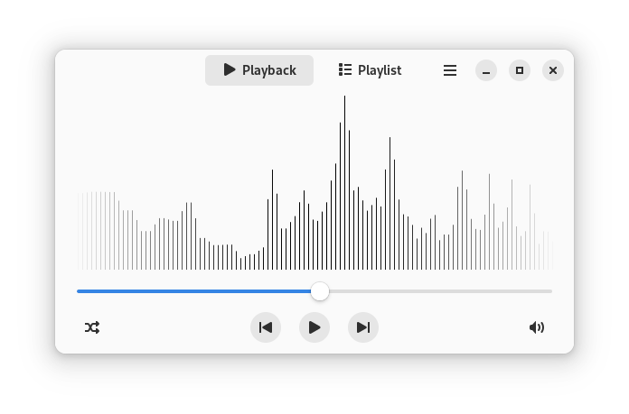

# Waveform
Lightweight GTK 4 and libadwaita audio visualiser written in C.
Rewrite of [A-Level coursework](https://github.com/lukawarren/realtime-audio-processor).



## Building
```
sudo pacman -S gtk4 libadwaita sdl2 fftw python-gobject
meson setup build
cd build
ninja
```

## Dependencies
- gtk4
- libadwaita
- SDL2
- SDL2_mixer (provided in-tree, slightly patched)
- fftw
- python-gobject (for blueprint compiler)

